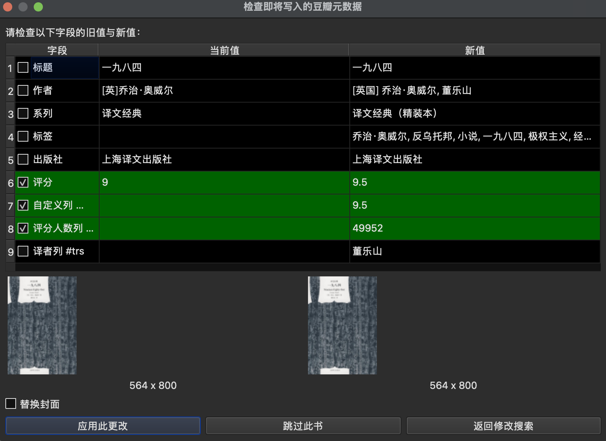

## NeoDouban

`NeoDouban` 是一个为 Calibre 设计的 **豆瓣图书元数据助手插件**，以“界面动作（工具栏按钮）”的形式工作，而不是传统的 Metadata Source 插件。  
它的目标是：**从豆瓣抓取元数据，并以高度可控的方式填充到当前 Calibre 库中（含自定义列）**。

---

### 功能概览

  
  

- 从豆瓣抓取：标题、作者、系列、出版社、出版时间、标签、简介、评分、评分人数、译者列表、封面、豆瓣 ID 和 ISBN。
- 支持将以下内容写入自定义列：
  - 评分（float 类型自定义列）
  - 评分人数（int 类型自定义列）
  - 译者信息（text 类型自定义列）
- 通过“检查对话框”逐本书、逐字段确认是否覆盖现有元数据。
- 支持按字段配置“默认填充列表”，不论是否检查，都只更新你允许的字段。
- 在检查对话框中直接预览“当前封面 / 豆瓣封面”缩略图。
- 一键在浏览器中打开当前书籍对应的豆瓣页面。

---

### 安装方法

1. 使用仓库根目录下的 `build.py` 打包插件，生成 `NeoDouban.zip`。  
2. 打开 Calibre：  
   - 进入 `首选项 -> 插件 -> 从文件加载插件`，选择 `NeoDouban.zip` 安装；  
   - 安装完成后重启 Calibre。  
3. 在 `首选项 -> 外观 -> 工具栏` 中，将 `Douban` 按钮加入主界面工具栏。

也可以直接从 Release 页面下载编译好的 ZIP 包：  
[NeoDouban.zip](https://github.com/fugary/calibre-douban/releases/latest/download/NeoDouban.zip)

---

### 自定义字段使用方法

1. 在Calibre的`管理列`中创建自定义列
   1. `浮点数/float`类型用于储存评分
   2. `整数/int`类型用于储存评分人数
   3. `文本/text`类型用于储存译者信息
2. 在插件的设置中配置自定义列
   1. 评分自定义列：选择刚刚创建的`float`类型自定义列，用于写入豆瓣评分
   2. 评分人数自定义列：选择刚刚创建的`int`类型自定义列，用于写入豆瓣评分人数
   3. 译者自定义列：选择刚刚创建的`text`类型自定义列，用于写入解析出来的译者列表

---

### 工具栏菜单

点击工具栏上的 `Douban` 按钮，会展开以下菜单：

- **填充元数据（带检查）**  
  - 对选中的书逐本执行豆瓣搜索；  
  - 每本书弹出“检查对话框”，显示新旧值对比，按字段勾选是否覆盖。

- **填充元数据（不检查）**  
  - 按设置中配置的“默认填充字段”直接批量写入，不弹出检查对话框。

- **在豆瓣中打开**  
  - 使用默认浏览器打开当前选中第一本书的豆瓣详情页：  
    `https://book.douban.com/subject/${new_douban_id}`。

- **设置**  
  - 打开本插件的设置窗口（不是 Calibre 全局设置）。

---

### 设置项说明

在“设置”中可以配置：

- **并发抓取数量**：  
  控制同时访问豆瓣图书详情页的最大并发数。

- **启用随机延迟**：  
  在每次请求豆瓣前随机等待一小段时间，降低被封禁风险。

- **检索时附带作者**：  
  构造搜索关键字时，将作者附加到书名后，有助于提高匹配准确度。

- **豆瓣登录 Cookie**：  
  可选，直接复制浏览器中登录豆瓣后的 Cookie 字符串，用于访问一些登录后才能看的页面。

- **评分自定义列（float 类型）**：  
  从当前库的自定义列中选择一个 `float` 类型列，用于写入豆瓣评分（1–5 星）。

- **评分人数自定义列（int 类型，可选）**：  
  选择一个 `int` 类型自定义列，用于写入豆瓣评分人数。

- **译者自定义列（text 类型，可选）**：  
  选择一个 `text` 类型自定义列，用于写入解析出来的译者列表（多译者会以逗号连接）。

- **默认填充字段**：  
  通过一组复选框选择哪些字段会被默认填充，支持：
  - 标题、作者、系列、标签、出版社、评分
  - 评分自定义列、评分人数列、译者列  
  这些选项会影响：
  - 无检查模式：只会更新这些字段，其它字段保持不变；  
  - 有检查模式：检查对话框中对应行默认勾选，其它字段默认不勾选。

---

### 搜索与检查流程

#### 搜索参数

对每一本选中书，插件会：

1. 从库中读取该书的 `标题 / 作者 / ISBN`。  
2. 构造默认搜索关键字（优先级）：  
   - 若存在有效 `ISBN`，则默认关键字为 `ISBN`；  
   - 否则，若启用“检索时附带作者”，则使用 `标题 + 作者`；  
   - 否则仅使用 `标题`。  
3. 弹出“搜索参数”对话框，仅包含一个“搜索关键字”输入框，默认值为上一步构造的关键字，你可以手动调整。  
4. 使用该关键字在豆瓣搜索，选择最匹配的一条图书记录。

在“带检查模式”下，如果在检查对话框中点击“返回修改搜索”，会回到步骤 3 重新输入关键字并再次搜索。

---

### 注意事项

- 插件依据当前豆瓣网页结构进行解析，如豆瓣页面有较大改版，可能需要更新解析逻辑。  
- 频繁/高并发访问豆瓣可能触发访问限制，建议保持适当的随机延迟和并发数。  
- 由于会批量修改 Calibre 库元数据，**建议在大量操作前对库做一次备份**。  

## Credits
[fugary/calibre-douban](https://github.com/fugary/calibre-douban)

---

欢迎在 GitHub 提交 [Issue](https://github.com/Exhen/NeoDouban/issues) 或 [PR](https://github.com/Exhen/NeoDouban/pulls) 反馈问题、提出需求。  

